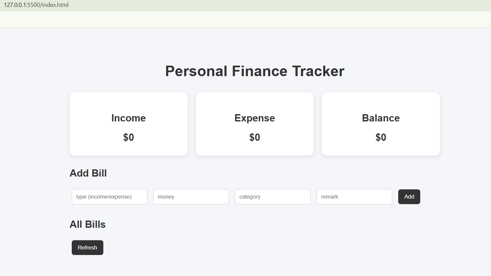

# Personal Finance Tracker

A full-stack personal finance tracking application that allows users to manage expenses, view bills, and monitor spending summaries.

## Features

- Create new bills
- View all bills
- Edit existing bills
- Delete bills
- Calculate spending summary
- Frontend and backend integration
- PostgreSQL database storage
- REST API design
- Cloud deployment

## Tech Stack

### Frontend
- HTML
- CSS
- JavaScript
- Fetch API

### Backend
- Python
- FastAPI
- PostgreSQL
- psycopg2

### Deployment
- Render

## Live Demo

Backend API Documentation:

https://personal-finance-api-aehs.onrender.com/docs

## Project Structure

## Screenshots

### Dashboard

